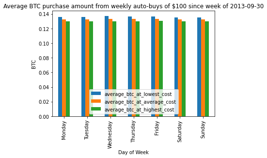
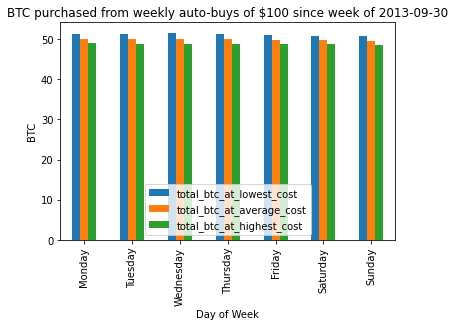

### TLDR. It doesn't really matter, difference is negligible. If you had started in 2013, Wednesday would have been ideal, but as of 2014 Friday appears to be the winner.

### The goal is to figure out which day of the week is the best day to set up a weekly bitcoin auto-buy.

#### I did the calculations for 24 hour highs, lows and the average of the two in order to show a worst-case to best-case scenario.

#### Some of the assumptions made.
+ No transaction costs. (This is be the same as assuming constant transaction cost)
+ Every purchase was 100 USD
+ Coindesk has correct numbers
+ Calculation are made from 2013-09-30 to 2020-12-22


```python
import pandas as pd
import datetime
import matplotlib
from helpers import seperate_into_weekdays, get_totals, get_average, plot_range, show_df, WEEKLY_BUY_USD
```


```python
# import data
historical_data = pd.read_csv('BTC_USD_2013-09-30_2020-12-22-CoinDesk.csv')

# clean and add relevant columns
historical_data['Date']= pd.to_datetime(historical_data['Date'])
historical_data['24h Mid (USD)'] = (historical_data['24h Low (USD)'] + historical_data['24h High (USD)']) / 2
historical_data['btc_at_highest_cost'] = WEEKLY_BUY_USD / historical_data['24h High (USD)']
historical_data['btc_at_lowest_cost'] = WEEKLY_BUY_USD / historical_data['24h Low (USD)']
historical_data['btc_at_average_cost'] = WEEKLY_BUY_USD / historical_data['24h Mid (USD)']
historical_data['week_day'] = historical_data['Date'].dt.day_name()
```

### Lets look at average BTC purchase for constant price in USD


```python
day_charts = seperate_into_weekdays(historical_data)
day_of_week_vals = get_average(day_charts)
plot_range(day_of_week_vals, 'Average BTC purchase amount')
show_df(day_of_week_vals)
```


<style  type="text/css" >
#T_9500a6be_458c_11eb_8b46_1e00621e9144row0_col1{
            background-color:  #b0dfaa;
            color:  #000000;
        }#T_9500a6be_458c_11eb_8b46_1e00621e9144row0_col2{
            background-color:  #92d28f;
            color:  #000000;
        }#T_9500a6be_458c_11eb_8b46_1e00621e9144row0_col3{
            background-color:  #99d595;
            color:  #000000;
        }#T_9500a6be_458c_11eb_8b46_1e00621e9144row1_col1{
            background-color:  #b7e2b1;
            color:  #000000;
        }#T_9500a6be_458c_11eb_8b46_1e00621e9144row1_col2{
            background-color:  #ceecc8;
            color:  #000000;
        }#T_9500a6be_458c_11eb_8b46_1e00621e9144row1_col3{
            background-color:  #edf8ea;
            color:  #000000;
        }#T_9500a6be_458c_11eb_8b46_1e00621e9144row2_col1,#T_9500a6be_458c_11eb_8b46_1e00621e9144row2_col2,#T_9500a6be_458c_11eb_8b46_1e00621e9144row4_col3{
            background-color:  #00441b;
            color:  #f1f1f1;
        }#T_9500a6be_458c_11eb_8b46_1e00621e9144row2_col3{
            background-color:  #90d18d;
            color:  #000000;
        }#T_9500a6be_458c_11eb_8b46_1e00621e9144row3_col1{
            background-color:  #40aa5d;
            color:  #000000;
        }#T_9500a6be_458c_11eb_8b46_1e00621e9144row3_col2{
            background-color:  #329b51;
            color:  #000000;
        }#T_9500a6be_458c_11eb_8b46_1e00621e9144row3_col3{
            background-color:  #acdea6;
            color:  #000000;
        }#T_9500a6be_458c_11eb_8b46_1e00621e9144row4_col1{
            background-color:  #73c476;
            color:  #000000;
        }#T_9500a6be_458c_11eb_8b46_1e00621e9144row4_col2{
            background-color:  #016e2d;
            color:  #f1f1f1;
        }#T_9500a6be_458c_11eb_8b46_1e00621e9144row5_col1,#T_9500a6be_458c_11eb_8b46_1e00621e9144row6_col2,#T_9500a6be_458c_11eb_8b46_1e00621e9144row6_col3{
            background-color:  #f7fcf5;
            color:  #000000;
        }#T_9500a6be_458c_11eb_8b46_1e00621e9144row5_col2{
            background-color:  #d4eece;
            color:  #000000;
        }#T_9500a6be_458c_11eb_8b46_1e00621e9144row5_col3{
            background-color:  #50b264;
            color:  #000000;
        }#T_9500a6be_458c_11eb_8b46_1e00621e9144row6_col1{
            background-color:  #eef8ea;
            color:  #000000;
        }</style><table id="T_9500a6be_458c_11eb_8b46_1e00621e9144" ><thead>    <tr>        <th class="blank level0" ></th>        <th class="col_heading level0 col0" >start</th>        <th class="col_heading level0 col1" >average_btc_at_lowest_cost</th>        <th class="col_heading level0 col2" >average_btc_at_average_cost</th>        <th class="col_heading level0 col3" >average_btc_at_highest_cost</th>    </tr></thead><tbody>
                <tr>
                        <th id="T_9500a6be_458c_11eb_8b46_1e00621e9144level0_row0" class="row_heading level0 row0" >Monday</th>
                        <td id="T_9500a6be_458c_11eb_8b46_1e00621e9144row0_col0" class="data row0 col0" >2013-09-30</td>
                        <td id="T_9500a6be_458c_11eb_8b46_1e00621e9144row0_col1" class="data row0 col1" >0.135853</td>
                        <td id="T_9500a6be_458c_11eb_8b46_1e00621e9144row0_col2" class="data row0 col2" >0.132694</td>
                        <td id="T_9500a6be_458c_11eb_8b46_1e00621e9144row0_col3" class="data row0 col3" >0.129822</td>
            </tr>
            <tr>
                        <th id="T_9500a6be_458c_11eb_8b46_1e00621e9144level0_row1" class="row_heading level0 row1" >Tuesday</th>
                        <td id="T_9500a6be_458c_11eb_8b46_1e00621e9144row1_col0" class="data row1 col0" >2013-10-01</td>
                        <td id="T_9500a6be_458c_11eb_8b46_1e00621e9144row1_col1" class="data row1 col1" >0.135807</td>
                        <td id="T_9500a6be_458c_11eb_8b46_1e00621e9144row1_col2" class="data row1 col2" >0.132512</td>
                        <td id="T_9500a6be_458c_11eb_8b46_1e00621e9144row1_col3" class="data row1 col3" >0.129563</td>
            </tr>
            <tr>
                        <th id="T_9500a6be_458c_11eb_8b46_1e00621e9144level0_row2" class="row_heading level0 row2" >Wednesday</th>
                        <td id="T_9500a6be_458c_11eb_8b46_1e00621e9144row2_col0" class="data row2 col0" >2013-10-02</td>
                        <td id="T_9500a6be_458c_11eb_8b46_1e00621e9144row2_col1" class="data row2 col1" >0.137195</td>
                        <td id="T_9500a6be_458c_11eb_8b46_1e00621e9144row2_col2" class="data row2 col2" >0.133243</td>
                        <td id="T_9500a6be_458c_11eb_8b46_1e00621e9144row2_col3" class="data row2 col3" >0.129844</td>
            </tr>
            <tr>
                        <th id="T_9500a6be_458c_11eb_8b46_1e00621e9144level0_row3" class="row_heading level0 row3" >Thursday</th>
                        <td id="T_9500a6be_458c_11eb_8b46_1e00621e9144row3_col0" class="data row3 col0" >2013-10-03</td>
                        <td id="T_9500a6be_458c_11eb_8b46_1e00621e9144row3_col1" class="data row3 col1" >0.136456</td>
                        <td id="T_9500a6be_458c_11eb_8b46_1e00621e9144row3_col2" class="data row3 col2" >0.132947</td>
                        <td id="T_9500a6be_458c_11eb_8b46_1e00621e9144row3_col3" class="data row3 col3" >0.129778</td>
            </tr>
            <tr>
                        <th id="T_9500a6be_458c_11eb_8b46_1e00621e9144level0_row4" class="row_heading level0 row4" >Friday</th>
                        <td id="T_9500a6be_458c_11eb_8b46_1e00621e9144row4_col0" class="data row4 col0" >2013-10-04</td>
                        <td id="T_9500a6be_458c_11eb_8b46_1e00621e9144row4_col1" class="data row4 col1" >0.136201</td>
                        <td id="T_9500a6be_458c_11eb_8b46_1e00621e9144row4_col2" class="data row4 col2" >0.133122</td>
                        <td id="T_9500a6be_458c_11eb_8b46_1e00621e9144row4_col3" class="data row4 col3" >0.130301</td>
            </tr>
            <tr>
                        <th id="T_9500a6be_458c_11eb_8b46_1e00621e9144level0_row5" class="row_heading level0 row5" >Saturday</th>
                        <td id="T_9500a6be_458c_11eb_8b46_1e00621e9144row5_col0" class="data row5 col0" >2013-10-05</td>
                        <td id="T_9500a6be_458c_11eb_8b46_1e00621e9144row5_col1" class="data row5 col1" >0.135205</td>
                        <td id="T_9500a6be_458c_11eb_8b46_1e00621e9144row5_col2" class="data row5 col2" >0.132488</td>
                        <td id="T_9500a6be_458c_11eb_8b46_1e00621e9144row5_col3" class="data row5 col3" >0.129975</td>
            </tr>
            <tr>
                        <th id="T_9500a6be_458c_11eb_8b46_1e00621e9144level0_row6" class="row_heading level0 row6" >Sunday</th>
                        <td id="T_9500a6be_458c_11eb_8b46_1e00621e9144row6_col0" class="data row6 col0" >2013-10-06</td>
                        <td id="T_9500a6be_458c_11eb_8b46_1e00621e9144row6_col1" class="data row6 col1" >0.135336</td>
                        <td id="T_9500a6be_458c_11eb_8b46_1e00621e9144row6_col2" class="data row6 col2" >0.132304</td>
                        <td id="T_9500a6be_458c_11eb_8b46_1e00621e9144row6_col3" class="data row6 col3" >0.129508</td>
            </tr>
    </tbody></table>


    

    


### Lets look at total BTC purchased for weekly autobuys of constant USD


```python
day_charts = seperate_into_weekdays(historical_data)
day_of_week_vals = get_totals(day_charts)
plot_range(day_of_week_vals, 'BTC purchased')
show_df(day_of_week_vals)
```


<style  type="text/css" >
#T_951ac2c4_458c_11eb_8b46_1e00621e9144row0_col1{
            background-color:  #268e47;
            color:  #000000;
        }#T_951ac2c4_458c_11eb_8b46_1e00621e9144row0_col2,#T_951ac2c4_458c_11eb_8b46_1e00621e9144row0_col3,#T_951ac2c4_458c_11eb_8b46_1e00621e9144row2_col1{
            background-color:  #00441b;
            color:  #f1f1f1;
        }#T_951ac2c4_458c_11eb_8b46_1e00621e9144row1_col1{
            background-color:  #5ab769;
            color:  #000000;
        }#T_951ac2c4_458c_11eb_8b46_1e00621e9144row1_col2{
            background-color:  #3fa95c;
            color:  #000000;
        }#T_951ac2c4_458c_11eb_8b46_1e00621e9144row1_col3{
            background-color:  #5eb96b;
            color:  #000000;
        }#T_951ac2c4_458c_11eb_8b46_1e00621e9144row2_col2{
            background-color:  #006729;
            color:  #f1f1f1;
        }#T_951ac2c4_458c_11eb_8b46_1e00621e9144row2_col3{
            background-color:  #72c375;
            color:  #000000;
        }#T_951ac2c4_458c_11eb_8b46_1e00621e9144row3_col1,#T_951ac2c4_458c_11eb_8b46_1e00621e9144row3_col2{
            background-color:  #329b51;
            color:  #000000;
        }#T_951ac2c4_458c_11eb_8b46_1e00621e9144row3_col3{
            background-color:  #84cc83;
            color:  #000000;
        }#T_951ac2c4_458c_11eb_8b46_1e00621e9144row4_col1{
            background-color:  #c2e7bb;
            color:  #000000;
        }#T_951ac2c4_458c_11eb_8b46_1e00621e9144row4_col2{
            background-color:  #b2e0ac;
            color:  #000000;
        }#T_951ac2c4_458c_11eb_8b46_1e00621e9144row4_col3{
            background-color:  #afdfa8;
            color:  #000000;
        }#T_951ac2c4_458c_11eb_8b46_1e00621e9144row5_col1,#T_951ac2c4_458c_11eb_8b46_1e00621e9144row6_col2,#T_951ac2c4_458c_11eb_8b46_1e00621e9144row6_col3{
            background-color:  #f7fcf5;
            color:  #000000;
        }#T_951ac2c4_458c_11eb_8b46_1e00621e9144row5_col2{
            background-color:  #e5f5e0;
            color:  #000000;
        }#T_951ac2c4_458c_11eb_8b46_1e00621e9144row5_col3{
            background-color:  #aadda4;
            color:  #000000;
        }#T_951ac2c4_458c_11eb_8b46_1e00621e9144row6_col1{
            background-color:  #eff9ec;
            color:  #000000;
        }</style><table id="T_951ac2c4_458c_11eb_8b46_1e00621e9144" ><thead>    <tr>        <th class="blank level0" ></th>        <th class="col_heading level0 col0" >start</th>        <th class="col_heading level0 col1" >total_btc_at_lowest_cost</th>        <th class="col_heading level0 col2" >total_btc_at_average_cost</th>        <th class="col_heading level0 col3" >total_btc_at_highest_cost</th>    </tr></thead><tbody>
                <tr>
                        <th id="T_951ac2c4_458c_11eb_8b46_1e00621e9144level0_row0" class="row_heading level0 row0" >Monday</th>
                        <td id="T_951ac2c4_458c_11eb_8b46_1e00621e9144row0_col0" class="data row0 col0" >2013-09-30</td>
                        <td id="T_951ac2c4_458c_11eb_8b46_1e00621e9144row0_col1" class="data row0 col1" >51.352589</td>
                        <td id="T_951ac2c4_458c_11eb_8b46_1e00621e9144row0_col2" class="data row0 col2" >50.158449</td>
                        <td id="T_951ac2c4_458c_11eb_8b46_1e00621e9144row0_col3" class="data row0 col3" >49.072891</td>
            </tr>
            <tr>
                        <th id="T_951ac2c4_458c_11eb_8b46_1e00621e9144level0_row1" class="row_heading level0 row1" >Tuesday</th>
                        <td id="T_951ac2c4_458c_11eb_8b46_1e00621e9144row1_col0" class="data row1 col0" >2013-10-01</td>
                        <td id="T_951ac2c4_458c_11eb_8b46_1e00621e9144row1_col1" class="data row1 col1" >51.199204</td>
                        <td id="T_951ac2c4_458c_11eb_8b46_1e00621e9144row1_col2" class="data row1 col2" >49.957002</td>
                        <td id="T_951ac2c4_458c_11eb_8b46_1e00621e9144row1_col3" class="data row1 col3" >48.845227</td>
            </tr>
            <tr>
                        <th id="T_951ac2c4_458c_11eb_8b46_1e00621e9144level0_row2" class="row_heading level0 row2" >Wednesday</th>
                        <td id="T_951ac2c4_458c_11eb_8b46_1e00621e9144row2_col0" class="data row2 col0" >2013-10-02</td>
                        <td id="T_951ac2c4_458c_11eb_8b46_1e00621e9144row2_col1" class="data row2 col1" >51.585286</td>
                        <td id="T_951ac2c4_458c_11eb_8b46_1e00621e9144row2_col2" class="data row2 col2" >50.099402</td>
                        <td id="T_951ac2c4_458c_11eb_8b46_1e00621e9144row2_col3" class="data row2 col3" >48.821320</td>
            </tr>
            <tr>
                        <th id="T_951ac2c4_458c_11eb_8b46_1e00621e9144level0_row3" class="row_heading level0 row3" >Thursday</th>
                        <td id="T_951ac2c4_458c_11eb_8b46_1e00621e9144row3_col0" class="data row3 col0" >2013-10-03</td>
                        <td id="T_951ac2c4_458c_11eb_8b46_1e00621e9144row3_col1" class="data row3 col1" >51.307381</td>
                        <td id="T_951ac2c4_458c_11eb_8b46_1e00621e9144row3_col2" class="data row3 col2" >49.987941</td>
                        <td id="T_951ac2c4_458c_11eb_8b46_1e00621e9144row3_col3" class="data row3 col3" >48.796356</td>
            </tr>
            <tr>
                        <th id="T_951ac2c4_458c_11eb_8b46_1e00621e9144level0_row4" class="row_heading level0 row4" >Friday</th>
                        <td id="T_951ac2c4_458c_11eb_8b46_1e00621e9144row4_col0" class="data row4 col0" >2013-10-04</td>
                        <td id="T_951ac2c4_458c_11eb_8b46_1e00621e9144row4_col1" class="data row4 col1" >50.939074</td>
                        <td id="T_951ac2c4_458c_11eb_8b46_1e00621e9144row4_col2" class="data row4 col2" >49.787460</td>
                        <td id="T_951ac2c4_458c_11eb_8b46_1e00621e9144row4_col3" class="data row4 col3" >48.732680</td>
            </tr>
            <tr>
                        <th id="T_951ac2c4_458c_11eb_8b46_1e00621e9144level0_row5" class="row_heading level0 row5" >Saturday</th>
                        <td id="T_951ac2c4_458c_11eb_8b46_1e00621e9144row5_col0" class="data row5 col0" >2013-10-05</td>
                        <td id="T_951ac2c4_458c_11eb_8b46_1e00621e9144row5_col1" class="data row5 col1" >50.701932</td>
                        <td id="T_951ac2c4_458c_11eb_8b46_1e00621e9144row5_col2" class="data row5 col2" >49.682844</td>
                        <td id="T_951ac2c4_458c_11eb_8b46_1e00621e9144row5_col3" class="data row5 col3" >48.740703</td>
            </tr>
            <tr>
                        <th id="T_951ac2c4_458c_11eb_8b46_1e00621e9144level0_row6" class="row_heading level0 row6" >Sunday</th>
                        <td id="T_951ac2c4_458c_11eb_8b46_1e00621e9144row6_col0" class="data row6 col0" >2013-10-06</td>
                        <td id="T_951ac2c4_458c_11eb_8b46_1e00621e9144row6_col1" class="data row6 col1" >50.750891</td>
                        <td id="T_951ac2c4_458c_11eb_8b46_1e00621e9144row6_col2" class="data row6 col2" >49.613885</td>
                        <td id="T_951ac2c4_458c_11eb_8b46_1e00621e9144row6_col3" class="data row6 col3" >48.565638</td>
            </tr>
    </tbody></table>


    

    


#### Difference between days appears to be negligible
+ Buying on wednesdays might give a benefit of 0.001% for average price. 
+ Totals give much less information, especially considering that the start date was a Monday. 

Since the purchases started in 2013 when BTC price was much lower compared to USD, this will give a much larger weight to the earlier days.

#### So lets explore if this holds for later


```python
# 2014 Jan 1st - today
day_charts = seperate_into_weekdays(historical_data, start_date=datetime.datetime(2014, 1, 1))
day_of_week_vals = get_average(day_charts)
show_df(day_of_week_vals)
```


<style  type="text/css" >
#T_952d8fee_458c_11eb_8b46_1e00621e9144row0_col1,#T_952d8fee_458c_11eb_8b46_1e00621e9144row0_col2,#T_952d8fee_458c_11eb_8b46_1e00621e9144row0_col3{
            background-color:  #f7fcf5;
            color:  #000000;
        }#T_952d8fee_458c_11eb_8b46_1e00621e9144row1_col1{
            background-color:  #c8e9c1;
            color:  #000000;
        }#T_952d8fee_458c_11eb_8b46_1e00621e9144row1_col2{
            background-color:  #e0f3db;
            color:  #000000;
        }#T_952d8fee_458c_11eb_8b46_1e00621e9144row1_col3{
            background-color:  #ebf7e7;
            color:  #000000;
        }#T_952d8fee_458c_11eb_8b46_1e00621e9144row2_col1{
            background-color:  #37a055;
            color:  #000000;
        }#T_952d8fee_458c_11eb_8b46_1e00621e9144row2_col2{
            background-color:  #65bd6f;
            color:  #000000;
        }#T_952d8fee_458c_11eb_8b46_1e00621e9144row2_col3{
            background-color:  #83cb82;
            color:  #000000;
        }#T_952d8fee_458c_11eb_8b46_1e00621e9144row3_col1,#T_952d8fee_458c_11eb_8b46_1e00621e9144row5_col3{
            background-color:  #0c7735;
            color:  #f1f1f1;
        }#T_952d8fee_458c_11eb_8b46_1e00621e9144row3_col2{
            background-color:  #40aa5d;
            color:  #000000;
        }#T_952d8fee_458c_11eb_8b46_1e00621e9144row3_col3{
            background-color:  #79c67a;
            color:  #000000;
        }#T_952d8fee_458c_11eb_8b46_1e00621e9144row4_col1,#T_952d8fee_458c_11eb_8b46_1e00621e9144row4_col2,#T_952d8fee_458c_11eb_8b46_1e00621e9144row4_col3{
            background-color:  #00441b;
            color:  #f1f1f1;
        }#T_952d8fee_458c_11eb_8b46_1e00621e9144row5_col1{
            background-color:  #97d492;
            color:  #000000;
        }#T_952d8fee_458c_11eb_8b46_1e00621e9144row5_col2{
            background-color:  #3aa357;
            color:  #000000;
        }#T_952d8fee_458c_11eb_8b46_1e00621e9144row6_col1{
            background-color:  #52b365;
            color:  #000000;
        }#T_952d8fee_458c_11eb_8b46_1e00621e9144row6_col2{
            background-color:  #3fa85b;
            color:  #000000;
        }#T_952d8fee_458c_11eb_8b46_1e00621e9144row6_col3{
            background-color:  #38a156;
            color:  #000000;
        }</style><table id="T_952d8fee_458c_11eb_8b46_1e00621e9144" ><thead>    <tr>        <th class="blank level0" ></th>        <th class="col_heading level0 col0" >start</th>        <th class="col_heading level0 col1" >average_btc_at_lowest_cost</th>        <th class="col_heading level0 col2" >average_btc_at_average_cost</th>        <th class="col_heading level0 col3" >average_btc_at_highest_cost</th>    </tr></thead><tbody>
                <tr>
                        <th id="T_952d8fee_458c_11eb_8b46_1e00621e9144level0_row0" class="row_heading level0 row0" >Monday</th>
                        <td id="T_952d8fee_458c_11eb_8b46_1e00621e9144row0_col0" class="data row0 col0" >2014-01-06</td>
                        <td id="T_952d8fee_458c_11eb_8b46_1e00621e9144row0_col1" class="data row0 col1" >0.126294</td>
                        <td id="T_952d8fee_458c_11eb_8b46_1e00621e9144row0_col2" class="data row0 col2" >0.123571</td>
                        <td id="T_952d8fee_458c_11eb_8b46_1e00621e9144row0_col3" class="data row0 col3" >0.121055</td>
            </tr>
            <tr>
                        <th id="T_952d8fee_458c_11eb_8b46_1e00621e9144level0_row1" class="row_heading level0 row1" >Tuesday</th>
                        <td id="T_952d8fee_458c_11eb_8b46_1e00621e9144row1_col0" class="data row1 col0" >2014-01-07</td>
                        <td id="T_952d8fee_458c_11eb_8b46_1e00621e9144row1_col1" class="data row1 col1" >0.126592</td>
                        <td id="T_952d8fee_458c_11eb_8b46_1e00621e9144row1_col2" class="data row1 col2" >0.123765</td>
                        <td id="T_952d8fee_458c_11eb_8b46_1e00621e9144row1_col3" class="data row1 col3" >0.121176</td>
            </tr>
            <tr>
                        <th id="T_952d8fee_458c_11eb_8b46_1e00621e9144level0_row2" class="row_heading level0 row2" >Wednesday</th>
                        <td id="T_952d8fee_458c_11eb_8b46_1e00621e9144row2_col0" class="data row2 col0" >2014-01-01</td>
                        <td id="T_952d8fee_458c_11eb_8b46_1e00621e9144row2_col1" class="data row2 col1" >0.127098</td>
                        <td id="T_952d8fee_458c_11eb_8b46_1e00621e9144row2_col2" class="data row2 col2" >0.124280</td>
                        <td id="T_952d8fee_458c_11eb_8b46_1e00621e9144row2_col3" class="data row2 col3" >0.121704</td>
            </tr>
            <tr>
                        <th id="T_952d8fee_458c_11eb_8b46_1e00621e9144level0_row3" class="row_heading level0 row3" >Thursday</th>
                        <td id="T_952d8fee_458c_11eb_8b46_1e00621e9144row3_col0" class="data row3 col0" >2014-01-02</td>
                        <td id="T_952d8fee_458c_11eb_8b46_1e00621e9144row3_col1" class="data row3 col1" >0.127296</td>
                        <td id="T_952d8fee_458c_11eb_8b46_1e00621e9144row3_col2" class="data row3 col2" >0.124396</td>
                        <td id="T_952d8fee_458c_11eb_8b46_1e00621e9144row3_col3" class="data row3 col3" >0.121737</td>
            </tr>
            <tr>
                        <th id="T_952d8fee_458c_11eb_8b46_1e00621e9144level0_row4" class="row_heading level0 row4" >Friday</th>
                        <td id="T_952d8fee_458c_11eb_8b46_1e00621e9144row4_col0" class="data row4 col0" >2014-01-03</td>
                        <td id="T_952d8fee_458c_11eb_8b46_1e00621e9144row4_col1" class="data row4 col1" >0.127499</td>
                        <td id="T_952d8fee_458c_11eb_8b46_1e00621e9144row4_col2" class="data row4 col2" >0.124890</td>
                        <td id="T_952d8fee_458c_11eb_8b46_1e00621e9144row4_col3" class="data row4 col3" >0.122464</td>
            </tr>
            <tr>
                        <th id="T_952d8fee_458c_11eb_8b46_1e00621e9144level0_row5" class="row_heading level0 row5" >Saturday</th>
                        <td id="T_952d8fee_458c_11eb_8b46_1e00621e9144row5_col0" class="data row5 col0" >2014-01-04</td>
                        <td id="T_952d8fee_458c_11eb_8b46_1e00621e9144row5_col1" class="data row5 col1" >0.126781</td>
                        <td id="T_952d8fee_458c_11eb_8b46_1e00621e9144row5_col2" class="data row5 col2" >0.124436</td>
                        <td id="T_952d8fee_458c_11eb_8b46_1e00621e9144row5_col3" class="data row5 col3" >0.122226</td>
            </tr>
            <tr>
                        <th id="T_952d8fee_458c_11eb_8b46_1e00621e9144level0_row6" class="row_heading level0 row6" >Sunday</th>
                        <td id="T_952d8fee_458c_11eb_8b46_1e00621e9144row6_col0" class="data row6 col0" >2014-01-05</td>
                        <td id="T_952d8fee_458c_11eb_8b46_1e00621e9144row6_col1" class="data row6 col1" >0.126999</td>
                        <td id="T_952d8fee_458c_11eb_8b46_1e00621e9144row6_col2" class="data row6 col2" >0.124407</td>
                        <td id="T_952d8fee_458c_11eb_8b46_1e00621e9144row6_col3" class="data row6 col3" >0.121988</td>
            </tr>
    </tbody></table>


```python
# 2015 Jan 1st - today
day_charts = seperate_into_weekdays(historical_data, start_date=datetime.datetime(2015, 1, 1))
day_of_week_vals = get_average(day_charts)
show_df(day_of_week_vals)
```


<style  type="text/css" >
#T_95317a3c_458c_11eb_8b46_1e00621e9144row0_col1,#T_95317a3c_458c_11eb_8b46_1e00621e9144row0_col2,#T_95317a3c_458c_11eb_8b46_1e00621e9144row0_col3{
            background-color:  #f7fcf5;
            color:  #000000;
        }#T_95317a3c_458c_11eb_8b46_1e00621e9144row1_col1{
            background-color:  #97d492;
            color:  #000000;
        }#T_95317a3c_458c_11eb_8b46_1e00621e9144row1_col2{
            background-color:  #caeac3;
            color:  #000000;
        }#T_95317a3c_458c_11eb_8b46_1e00621e9144row1_col3{
            background-color:  #e7f6e2;
            color:  #000000;
        }#T_95317a3c_458c_11eb_8b46_1e00621e9144row2_col1{
            background-color:  #05712f;
            color:  #f1f1f1;
        }#T_95317a3c_458c_11eb_8b46_1e00621e9144row2_col2{
            background-color:  #3fa95c;
            color:  #000000;
        }#T_95317a3c_458c_11eb_8b46_1e00621e9144row2_col3{
            background-color:  #81ca81;
            color:  #000000;
        }#T_95317a3c_458c_11eb_8b46_1e00621e9144row3_col1{
            background-color:  #005924;
            color:  #f1f1f1;
        }#T_95317a3c_458c_11eb_8b46_1e00621e9144row3_col2{
            background-color:  #067230;
            color:  #f1f1f1;
        }#T_95317a3c_458c_11eb_8b46_1e00621e9144row3_col3{
            background-color:  #18823d;
            color:  #f1f1f1;
        }#T_95317a3c_458c_11eb_8b46_1e00621e9144row4_col1,#T_95317a3c_458c_11eb_8b46_1e00621e9144row4_col2,#T_95317a3c_458c_11eb_8b46_1e00621e9144row4_col3{
            background-color:  #00441b;
            color:  #f1f1f1;
        }#T_95317a3c_458c_11eb_8b46_1e00621e9144row5_col1{
            background-color:  #48ae60;
            color:  #000000;
        }#T_95317a3c_458c_11eb_8b46_1e00621e9144row5_col2{
            background-color:  #359e53;
            color:  #000000;
        }#T_95317a3c_458c_11eb_8b46_1e00621e9144row5_col3{
            background-color:  #2a924a;
            color:  #000000;
        }#T_95317a3c_458c_11eb_8b46_1e00621e9144row6_col1{
            background-color:  #46ae60;
            color:  #000000;
        }#T_95317a3c_458c_11eb_8b46_1e00621e9144row6_col2{
            background-color:  #4eb264;
            color:  #000000;
        }#T_95317a3c_458c_11eb_8b46_1e00621e9144row6_col3{
            background-color:  #56b567;
            color:  #000000;
        }</style><table id="T_95317a3c_458c_11eb_8b46_1e00621e9144" ><thead>    <tr>        <th class="blank level0" ></th>        <th class="col_heading level0 col0" >start</th>        <th class="col_heading level0 col1" >average_btc_at_lowest_cost</th>        <th class="col_heading level0 col2" >average_btc_at_average_cost</th>        <th class="col_heading level0 col3" >average_btc_at_highest_cost</th>    </tr></thead><tbody>
                <tr>
                        <th id="T_95317a3c_458c_11eb_8b46_1e00621e9144level0_row0" class="row_heading level0 row0" >Monday</th>
                        <td id="T_95317a3c_458c_11eb_8b46_1e00621e9144row0_col0" class="data row0 col0" >2015-01-05</td>
                        <td id="T_95317a3c_458c_11eb_8b46_1e00621e9144row0_col1" class="data row0 col1" >0.111888</td>
                        <td id="T_95317a3c_458c_11eb_8b46_1e00621e9144row0_col2" class="data row0 col2" >0.109747</td>
                        <td id="T_95317a3c_458c_11eb_8b46_1e00621e9144row0_col3" class="data row0 col3" >0.107746</td>
            </tr>
            <tr>
                        <th id="T_95317a3c_458c_11eb_8b46_1e00621e9144level0_row1" class="row_heading level0 row1" >Tuesday</th>
                        <td id="T_95317a3c_458c_11eb_8b46_1e00621e9144row1_col0" class="data row1 col0" >2015-01-06</td>
                        <td id="T_95317a3c_458c_11eb_8b46_1e00621e9144row1_col1" class="data row1 col1" >0.112507</td>
                        <td id="T_95317a3c_458c_11eb_8b46_1e00621e9144row1_col2" class="data row1 col2" >0.110120</td>
                        <td id="T_95317a3c_458c_11eb_8b46_1e00621e9144row1_col3" class="data row1 col3" >0.107927</td>
            </tr>
            <tr>
                        <th id="T_95317a3c_458c_11eb_8b46_1e00621e9144level0_row2" class="row_heading level0 row2" >Wednesday</th>
                        <td id="T_95317a3c_458c_11eb_8b46_1e00621e9144row2_col0" class="data row2 col0" >2015-01-07</td>
                        <td id="T_95317a3c_458c_11eb_8b46_1e00621e9144row2_col1" class="data row2 col1" >0.113204</td>
                        <td id="T_95317a3c_458c_11eb_8b46_1e00621e9144row2_col2" class="data row2 col2" >0.110729</td>
                        <td id="T_95317a3c_458c_11eb_8b46_1e00621e9144row2_col3" class="data row2 col3" >0.108478</td>
            </tr>
            <tr>
                        <th id="T_95317a3c_458c_11eb_8b46_1e00621e9144level0_row3" class="row_heading level0 row3" >Thursday</th>
                        <td id="T_95317a3c_458c_11eb_8b46_1e00621e9144row3_col0" class="data row3 col0" >2015-01-01</td>
                        <td id="T_95317a3c_458c_11eb_8b46_1e00621e9144row3_col1" class="data row3 col1" >0.113328</td>
                        <td id="T_95317a3c_458c_11eb_8b46_1e00621e9144row3_col2" class="data row3 col2" >0.111074</td>
                        <td id="T_95317a3c_458c_11eb_8b46_1e00621e9144row3_col3" class="data row3 col3" >0.108990</td>
            </tr>
            <tr>
                        <th id="T_95317a3c_458c_11eb_8b46_1e00621e9144level0_row4" class="row_heading level0 row4" >Friday</th>
                        <td id="T_95317a3c_458c_11eb_8b46_1e00621e9144row4_col0" class="data row4 col0" >2015-01-02</td>
                        <td id="T_95317a3c_458c_11eb_8b46_1e00621e9144row4_col1" class="data row4 col1" >0.113425</td>
                        <td id="T_95317a3c_458c_11eb_8b46_1e00621e9144row4_col2" class="data row4 col2" >0.111303</td>
                        <td id="T_95317a3c_458c_11eb_8b46_1e00621e9144row4_col3" class="data row4 col3" >0.109324</td>
            </tr>
            <tr>
                        <th id="T_95317a3c_458c_11eb_8b46_1e00621e9144level0_row5" class="row_heading level0 row5" >Saturday</th>
                        <td id="T_95317a3c_458c_11eb_8b46_1e00621e9144row5_col0" class="data row5 col0" >2015-01-03</td>
                        <td id="T_95317a3c_458c_11eb_8b46_1e00621e9144row5_col1" class="data row5 col1" >0.112825</td>
                        <td id="T_95317a3c_458c_11eb_8b46_1e00621e9144row5_col2" class="data row5 col2" >0.110795</td>
                        <td id="T_95317a3c_458c_11eb_8b46_1e00621e9144row5_col3" class="data row5 col3" >0.108882</td>
            </tr>
            <tr>
                        <th id="T_95317a3c_458c_11eb_8b46_1e00621e9144level0_row6" class="row_heading level0 row6" >Sunday</th>
                        <td id="T_95317a3c_458c_11eb_8b46_1e00621e9144row6_col0" class="data row6 col0" >2015-01-04</td>
                        <td id="T_95317a3c_458c_11eb_8b46_1e00621e9144row6_col1" class="data row6 col1" >0.112825</td>
                        <td id="T_95317a3c_458c_11eb_8b46_1e00621e9144row6_col2" class="data row6 col2" >0.110669</td>
                        <td id="T_95317a3c_458c_11eb_8b46_1e00621e9144row6_col3" class="data row6 col3" >0.108651</td>
            </tr>
    </tbody></table>


```python
# 2016 Jan 1st - today
day_charts = seperate_into_weekdays(historical_data, start_date=datetime.datetime(2016, 1, 1))
day_of_week_vals = get_average(day_charts)
show_df(day_of_week_vals)
```


<style  type="text/css" >
#T_95355486_458c_11eb_8b46_1e00621e9144row0_col1,#T_95355486_458c_11eb_8b46_1e00621e9144row0_col2,#T_95355486_458c_11eb_8b46_1e00621e9144row3_col3{
            background-color:  #f7fcf5;
            color:  #000000;
        }#T_95355486_458c_11eb_8b46_1e00621e9144row0_col3,#T_95355486_458c_11eb_8b46_1e00621e9144row1_col1{
            background-color:  #d4eece;
            color:  #000000;
        }#T_95355486_458c_11eb_8b46_1e00621e9144row1_col2{
            background-color:  #e4f5df;
            color:  #000000;
        }#T_95355486_458c_11eb_8b46_1e00621e9144row1_col3{
            background-color:  #ceecc8;
            color:  #000000;
        }#T_95355486_458c_11eb_8b46_1e00621e9144row2_col1{
            background-color:  #bbe4b4;
            color:  #000000;
        }#T_95355486_458c_11eb_8b46_1e00621e9144row2_col2{
            background-color:  #d9f0d3;
            color:  #000000;
        }#T_95355486_458c_11eb_8b46_1e00621e9144row2_col3{
            background-color:  #d1edcb;
            color:  #000000;
        }#T_95355486_458c_11eb_8b46_1e00621e9144row3_col1{
            background-color:  #c9eac2;
            color:  #000000;
        }#T_95355486_458c_11eb_8b46_1e00621e9144row3_col2{
            background-color:  #f1faee;
            color:  #000000;
        }#T_95355486_458c_11eb_8b46_1e00621e9144row4_col1,#T_95355486_458c_11eb_8b46_1e00621e9144row4_col2,#T_95355486_458c_11eb_8b46_1e00621e9144row4_col3{
            background-color:  #00441b;
            color:  #f1f1f1;
        }#T_95355486_458c_11eb_8b46_1e00621e9144row5_col1{
            background-color:  #56b567;
            color:  #000000;
        }#T_95355486_458c_11eb_8b46_1e00621e9144row5_col2{
            background-color:  #39a257;
            color:  #000000;
        }#T_95355486_458c_11eb_8b46_1e00621e9144row5_col3{
            background-color:  #107a37;
            color:  #f1f1f1;
        }#T_95355486_458c_11eb_8b46_1e00621e9144row6_col1{
            background-color:  #9bd696;
            color:  #000000;
        }#T_95355486_458c_11eb_8b46_1e00621e9144row6_col2{
            background-color:  #80ca80;
            color:  #000000;
        }#T_95355486_458c_11eb_8b46_1e00621e9144row6_col3{
            background-color:  #3ca559;
            color:  #000000;
        }</style><table id="T_95355486_458c_11eb_8b46_1e00621e9144" ><thead>    <tr>        <th class="blank level0" ></th>        <th class="col_heading level0 col0" >start</th>        <th class="col_heading level0 col1" >average_btc_at_lowest_cost</th>        <th class="col_heading level0 col2" >average_btc_at_average_cost</th>        <th class="col_heading level0 col3" >average_btc_at_highest_cost</th>    </tr></thead><tbody>
                <tr>
                        <th id="T_95355486_458c_11eb_8b46_1e00621e9144level0_row0" class="row_heading level0 row0" >Monday</th>
                        <td id="T_95355486_458c_11eb_8b46_1e00621e9144row0_col0" class="data row0 col0" >2016-01-04</td>
                        <td id="T_95355486_458c_11eb_8b46_1e00621e9144row0_col1" class="data row0 col1" >0.056599</td>
                        <td id="T_95355486_458c_11eb_8b46_1e00621e9144row0_col2" class="data row0 col2" >0.055711</td>
                        <td id="T_95355486_458c_11eb_8b46_1e00621e9144row0_col3" class="data row0 col3" >0.054876</td>
            </tr>
            <tr>
                        <th id="T_95355486_458c_11eb_8b46_1e00621e9144level0_row1" class="row_heading level0 row1" >Tuesday</th>
                        <td id="T_95355486_458c_11eb_8b46_1e00621e9144row1_col0" class="data row1 col0" >2016-01-05</td>
                        <td id="T_95355486_458c_11eb_8b46_1e00621e9144row1_col1" class="data row1 col1" >0.056866</td>
                        <td id="T_95355486_458c_11eb_8b46_1e00621e9144row1_col2" class="data row1 col2" >0.055847</td>
                        <td id="T_95355486_458c_11eb_8b46_1e00621e9144row1_col3" class="data row1 col3" >0.054899</td>
            </tr>
            <tr>
                        <th id="T_95355486_458c_11eb_8b46_1e00621e9144level0_row2" class="row_heading level0 row2" >Wednesday</th>
                        <td id="T_95355486_458c_11eb_8b46_1e00621e9144row2_col0" class="data row2 col0" >2016-01-06</td>
                        <td id="T_95355486_458c_11eb_8b46_1e00621e9144row2_col1" class="data row2 col1" >0.056994</td>
                        <td id="T_95355486_458c_11eb_8b46_1e00621e9144row2_col2" class="data row2 col2" >0.055899</td>
                        <td id="T_95355486_458c_11eb_8b46_1e00621e9144row2_col3" class="data row2 col3" >0.054885</td>
            </tr>
            <tr>
                        <th id="T_95355486_458c_11eb_8b46_1e00621e9144level0_row3" class="row_heading level0 row3" >Thursday</th>
                        <td id="T_95355486_458c_11eb_8b46_1e00621e9144row3_col0" class="data row3 col0" >2016-01-07</td>
                        <td id="T_95355486_458c_11eb_8b46_1e00621e9144row3_col1" class="data row3 col1" >0.056928</td>
                        <td id="T_95355486_458c_11eb_8b46_1e00621e9144row3_col2" class="data row3 col2" >0.055757</td>
                        <td id="T_95355486_458c_11eb_8b46_1e00621e9144row3_col3" class="data row3 col3" >0.054682</td>
            </tr>
            <tr>
                        <th id="T_95355486_458c_11eb_8b46_1e00621e9144level0_row4" class="row_heading level0 row4" >Friday</th>
                        <td id="T_95355486_458c_11eb_8b46_1e00621e9144row4_col0" class="data row4 col0" >2016-01-01</td>
                        <td id="T_95355486_458c_11eb_8b46_1e00621e9144row4_col1" class="data row4 col1" >0.057957</td>
                        <td id="T_95355486_458c_11eb_8b46_1e00621e9144row4_col2" class="data row4 col2" >0.056757</td>
                        <td id="T_95355486_458c_11eb_8b46_1e00621e9144row4_col3" class="data row4 col3" >0.055659</td>
            </tr>
            <tr>
                        <th id="T_95355486_458c_11eb_8b46_1e00621e9144level0_row5" class="row_heading level0 row5" >Saturday</th>
                        <td id="T_95355486_458c_11eb_8b46_1e00621e9144row5_col0" class="data row5 col0" >2016-01-02</td>
                        <td id="T_95355486_458c_11eb_8b46_1e00621e9144row5_col1" class="data row5 col1" >0.057374</td>
                        <td id="T_95355486_458c_11eb_8b46_1e00621e9144row5_col2" class="data row5 col2" >0.056399</td>
                        <td id="T_95355486_458c_11eb_8b46_1e00621e9144row5_col3" class="data row5 col3" >0.055481</td>
            </tr>
            <tr>
                        <th id="T_95355486_458c_11eb_8b46_1e00621e9144level0_row6" class="row_heading level0 row6" >Sunday</th>
                        <td id="T_95355486_458c_11eb_8b46_1e00621e9144row6_col0" class="data row6 col0" >2016-01-03</td>
                        <td id="T_95355486_458c_11eb_8b46_1e00621e9144row6_col1" class="data row6 col1" >0.057134</td>
                        <td id="T_95355486_458c_11eb_8b46_1e00621e9144row6_col2" class="data row6 col2" >0.056200</td>
                        <td id="T_95355486_458c_11eb_8b46_1e00621e9144row6_col3" class="data row6 col3" >0.055315</td>
            </tr>
    </tbody></table>


```python
# 2017 Jan 1st - today
day_charts = seperate_into_weekdays(historical_data, start_date=datetime.datetime(2017, 1, 1))
day_of_week_vals = get_average(day_charts)
show_df(day_of_week_vals)
```


<style  type="text/css" >
#T_953930ec_458c_11eb_8b46_1e00621e9144row0_col1{
            background-color:  #78c679;
            color:  #000000;
        }#T_953930ec_458c_11eb_8b46_1e00621e9144row0_col2{
            background-color:  #7fc97f;
            color:  #000000;
        }#T_953930ec_458c_11eb_8b46_1e00621e9144row0_col3{
            background-color:  #62bb6d;
            color:  #000000;
        }#T_953930ec_458c_11eb_8b46_1e00621e9144row1_col1{
            background-color:  #f4fbf2;
            color:  #000000;
        }#T_953930ec_458c_11eb_8b46_1e00621e9144row1_col2{
            background-color:  #f2faef;
            color:  #000000;
        }#T_953930ec_458c_11eb_8b46_1e00621e9144row1_col3{
            background-color:  #b6e2af;
            color:  #000000;
        }#T_953930ec_458c_11eb_8b46_1e00621e9144row2_col1{
            background-color:  #bae3b3;
            color:  #000000;
        }#T_953930ec_458c_11eb_8b46_1e00621e9144row2_col2{
            background-color:  #e7f6e3;
            color:  #000000;
        }#T_953930ec_458c_11eb_8b46_1e00621e9144row2_col3{
            background-color:  #caeac3;
            color:  #000000;
        }#T_953930ec_458c_11eb_8b46_1e00621e9144row3_col1{
            background-color:  #6ec173;
            color:  #000000;
        }#T_953930ec_458c_11eb_8b46_1e00621e9144row3_col2,#T_953930ec_458c_11eb_8b46_1e00621e9144row3_col3,#T_953930ec_458c_11eb_8b46_1e00621e9144row5_col1{
            background-color:  #f7fcf5;
            color:  #000000;
        }#T_953930ec_458c_11eb_8b46_1e00621e9144row4_col1,#T_953930ec_458c_11eb_8b46_1e00621e9144row6_col2,#T_953930ec_458c_11eb_8b46_1e00621e9144row6_col3{
            background-color:  #00441b;
            color:  #f1f1f1;
        }#T_953930ec_458c_11eb_8b46_1e00621e9144row4_col2{
            background-color:  #6bc072;
            color:  #000000;
        }#T_953930ec_458c_11eb_8b46_1e00621e9144row4_col3{
            background-color:  #abdda5;
            color:  #000000;
        }#T_953930ec_458c_11eb_8b46_1e00621e9144row5_col2{
            background-color:  #e6f5e1;
            color:  #000000;
        }#T_953930ec_458c_11eb_8b46_1e00621e9144row5_col3{
            background-color:  #90d18d;
            color:  #000000;
        }#T_953930ec_458c_11eb_8b46_1e00621e9144row6_col1{
            background-color:  #1a843f;
            color:  #000000;
        }</style><table id="T_953930ec_458c_11eb_8b46_1e00621e9144" ><thead>    <tr>        <th class="blank level0" ></th>        <th class="col_heading level0 col0" >start</th>        <th class="col_heading level0 col1" >average_btc_at_lowest_cost</th>        <th class="col_heading level0 col2" >average_btc_at_average_cost</th>        <th class="col_heading level0 col3" >average_btc_at_highest_cost</th>    </tr></thead><tbody>
                <tr>
                        <th id="T_953930ec_458c_11eb_8b46_1e00621e9144level0_row0" class="row_heading level0 row0" >Monday</th>
                        <td id="T_953930ec_458c_11eb_8b46_1e00621e9144row0_col0" class="data row0 col0" >2017-01-02</td>
                        <td id="T_953930ec_458c_11eb_8b46_1e00621e9144row0_col1" class="data row0 col1" >0.023452</td>
                        <td id="T_953930ec_458c_11eb_8b46_1e00621e9144row0_col2" class="data row0 col2" >0.022829</td>
                        <td id="T_953930ec_458c_11eb_8b46_1e00621e9144row0_col3" class="data row0 col3" >0.022255</td>
            </tr>
            <tr>
                        <th id="T_953930ec_458c_11eb_8b46_1e00621e9144level0_row1" class="row_heading level0 row1" >Tuesday</th>
                        <td id="T_953930ec_458c_11eb_8b46_1e00621e9144row1_col0" class="data row1 col0" >2017-01-03</td>
                        <td id="T_953930ec_458c_11eb_8b46_1e00621e9144row1_col1" class="data row1 col1" >0.023282</td>
                        <td id="T_953930ec_458c_11eb_8b46_1e00621e9144row1_col2" class="data row1 col2" >0.022682</td>
                        <td id="T_953930ec_458c_11eb_8b46_1e00621e9144row1_col3" class="data row1 col3" >0.022126</td>
            </tr>
            <tr>
                        <th id="T_953930ec_458c_11eb_8b46_1e00621e9144level0_row2" class="row_heading level0 row2" >Wednesday</th>
                        <td id="T_953930ec_458c_11eb_8b46_1e00621e9144row2_col0" class="data row2 col0" >2017-01-04</td>
                        <td id="T_953930ec_458c_11eb_8b46_1e00621e9144row2_col1" class="data row2 col1" >0.023380</td>
                        <td id="T_953930ec_458c_11eb_8b46_1e00621e9144row2_col2" class="data row2 col2" >0.022707</td>
                        <td id="T_953930ec_458c_11eb_8b46_1e00621e9144row2_col3" class="data row2 col3" >0.022091</td>
            </tr>
            <tr>
                        <th id="T_953930ec_458c_11eb_8b46_1e00621e9144level0_row3" class="row_heading level0 row3" >Thursday</th>
                        <td id="T_953930ec_458c_11eb_8b46_1e00621e9144row3_col0" class="data row3 col0" >2017-01-05</td>
                        <td id="T_953930ec_458c_11eb_8b46_1e00621e9144row3_col1" class="data row3 col1" >0.023461</td>
                        <td id="T_953930ec_458c_11eb_8b46_1e00621e9144row3_col2" class="data row3 col2" >0.022669</td>
                        <td id="T_953930ec_458c_11eb_8b46_1e00621e9144row3_col3" class="data row3 col3" >0.021962</td>
            </tr>
            <tr>
                        <th id="T_953930ec_458c_11eb_8b46_1e00621e9144level0_row4" class="row_heading level0 row4" >Friday</th>
                        <td id="T_953930ec_458c_11eb_8b46_1e00621e9144row4_col0" class="data row4 col0" >2017-01-06</td>
                        <td id="T_953930ec_458c_11eb_8b46_1e00621e9144row4_col1" class="data row4 col1" >0.023637</td>
                        <td id="T_953930ec_458c_11eb_8b46_1e00621e9144row4_col2" class="data row4 col2" >0.022846</td>
                        <td id="T_953930ec_458c_11eb_8b46_1e00621e9144row4_col3" class="data row4 col3" >0.022145</td>
            </tr>
            <tr>
                        <th id="T_953930ec_458c_11eb_8b46_1e00621e9144level0_row5" class="row_heading level0 row5" >Saturday</th>
                        <td id="T_953930ec_458c_11eb_8b46_1e00621e9144row5_col0" class="data row5 col0" >2017-01-07</td>
                        <td id="T_953930ec_458c_11eb_8b46_1e00621e9144row5_col1" class="data row5 col1" >0.023274</td>
                        <td id="T_953930ec_458c_11eb_8b46_1e00621e9144row5_col2" class="data row5 col2" >0.022710</td>
                        <td id="T_953930ec_458c_11eb_8b46_1e00621e9144row5_col3" class="data row5 col3" >0.022189</td>
            </tr>
            <tr>
                        <th id="T_953930ec_458c_11eb_8b46_1e00621e9144level0_row6" class="row_heading level0 row6" >Sunday</th>
                        <td id="T_953930ec_458c_11eb_8b46_1e00621e9144row6_col0" class="data row6 col0" >2017-01-01</td>
                        <td id="T_953930ec_458c_11eb_8b46_1e00621e9144row6_col1" class="data row6 col1" >0.023557</td>
                        <td id="T_953930ec_458c_11eb_8b46_1e00621e9144row6_col2" class="data row6 col2" >0.023009</td>
                        <td id="T_953930ec_458c_11eb_8b46_1e00621e9144row6_col3" class="data row6 col3" >0.022498</td>
            </tr>
    </tbody></table>


```python
# 2018 Jan 1st - today
day_charts = seperate_into_weekdays(historical_data, start_date=datetime.datetime(2018, 1, 1))
day_of_week_vals = get_average(day_charts)
show_df(day_of_week_vals)
```


<style  type="text/css" >
#T_953d259e_458c_11eb_8b46_1e00621e9144row0_col1{
            background-color:  #137d39;
            color:  #f1f1f1;
        }#T_953d259e_458c_11eb_8b46_1e00621e9144row0_col2{
            background-color:  #7ac77b;
            color:  #000000;
        }#T_953d259e_458c_11eb_8b46_1e00621e9144row0_col3,#T_953d259e_458c_11eb_8b46_1e00621e9144row5_col1,#T_953d259e_458c_11eb_8b46_1e00621e9144row5_col2{
            background-color:  #f7fcf5;
            color:  #000000;
        }#T_953d259e_458c_11eb_8b46_1e00621e9144row1_col1{
            background-color:  #4eb264;
            color:  #000000;
        }#T_953d259e_458c_11eb_8b46_1e00621e9144row1_col2{
            background-color:  #7cc87c;
            color:  #000000;
        }#T_953d259e_458c_11eb_8b46_1e00621e9144row1_col3{
            background-color:  #8dd08a;
            color:  #000000;
        }#T_953d259e_458c_11eb_8b46_1e00621e9144row2_col1{
            background-color:  #38a156;
            color:  #000000;
        }#T_953d259e_458c_11eb_8b46_1e00621e9144row2_col2{
            background-color:  #6dc072;
            color:  #000000;
        }#T_953d259e_458c_11eb_8b46_1e00621e9144row2_col3{
            background-color:  #a3da9d;
            color:  #000000;
        }#T_953d259e_458c_11eb_8b46_1e00621e9144row3_col1{
            background-color:  #005723;
            color:  #f1f1f1;
        }#T_953d259e_458c_11eb_8b46_1e00621e9144row3_col2{
            background-color:  #1d8640;
            color:  #000000;
        }#T_953d259e_458c_11eb_8b46_1e00621e9144row3_col3{
            background-color:  #79c67a;
            color:  #000000;
        }#T_953d259e_458c_11eb_8b46_1e00621e9144row4_col1,#T_953d259e_458c_11eb_8b46_1e00621e9144row4_col2,#T_953d259e_458c_11eb_8b46_1e00621e9144row4_col3{
            background-color:  #00441b;
            color:  #f1f1f1;
        }#T_953d259e_458c_11eb_8b46_1e00621e9144row5_col3{
            background-color:  #99d595;
            color:  #000000;
        }#T_953d259e_458c_11eb_8b46_1e00621e9144row6_col1{
            background-color:  #daf0d4;
            color:  #000000;
        }#T_953d259e_458c_11eb_8b46_1e00621e9144row6_col2{
            background-color:  #f1faee;
            color:  #000000;
        }#T_953d259e_458c_11eb_8b46_1e00621e9144row6_col3{
            background-color:  #e0f3db;
            color:  #000000;
        }</style><table id="T_953d259e_458c_11eb_8b46_1e00621e9144" ><thead>    <tr>        <th class="blank level0" ></th>        <th class="col_heading level0 col0" >start</th>        <th class="col_heading level0 col1" >average_btc_at_lowest_cost</th>        <th class="col_heading level0 col2" >average_btc_at_average_cost</th>        <th class="col_heading level0 col3" >average_btc_at_highest_cost</th>    </tr></thead><tbody>
                <tr>
                        <th id="T_953d259e_458c_11eb_8b46_1e00621e9144level0_row0" class="row_heading level0 row0" >Monday</th>
                        <td id="T_953d259e_458c_11eb_8b46_1e00621e9144row0_col0" class="data row0 col0" >2018-01-01</td>
                        <td id="T_953d259e_458c_11eb_8b46_1e00621e9144row0_col1" class="data row0 col1" >0.014049</td>
                        <td id="T_953d259e_458c_11eb_8b46_1e00621e9144row0_col2" class="data row0 col2" >0.013636</td>
                        <td id="T_953d259e_458c_11eb_8b46_1e00621e9144row0_col3" class="data row0 col3" >0.013259</td>
            </tr>
            <tr>
                        <th id="T_953d259e_458c_11eb_8b46_1e00621e9144level0_row1" class="row_heading level0 row1" >Tuesday</th>
                        <td id="T_953d259e_458c_11eb_8b46_1e00621e9144row1_col0" class="data row1 col0" >2018-01-02</td>
                        <td id="T_953d259e_458c_11eb_8b46_1e00621e9144row1_col1" class="data row1 col1" >0.013997</td>
                        <td id="T_953d259e_458c_11eb_8b46_1e00621e9144row1_col2" class="data row1 col2" >0.013635</td>
                        <td id="T_953d259e_458c_11eb_8b46_1e00621e9144row1_col3" class="data row1 col3" >0.013303</td>
            </tr>
            <tr>
                        <th id="T_953d259e_458c_11eb_8b46_1e00621e9144level0_row2" class="row_heading level0 row2" >Wednesday</th>
                        <td id="T_953d259e_458c_11eb_8b46_1e00621e9144row2_col0" class="data row2 col0" >2018-01-03</td>
                        <td id="T_953d259e_458c_11eb_8b46_1e00621e9144row2_col1" class="data row2 col1" >0.014014</td>
                        <td id="T_953d259e_458c_11eb_8b46_1e00621e9144row2_col2" class="data row2 col2" >0.013641</td>
                        <td id="T_953d259e_458c_11eb_8b46_1e00621e9144row2_col3" class="data row2 col3" >0.013297</td>
            </tr>
            <tr>
                        <th id="T_953d259e_458c_11eb_8b46_1e00621e9144level0_row3" class="row_heading level0 row3" >Thursday</th>
                        <td id="T_953d259e_458c_11eb_8b46_1e00621e9144row3_col0" class="data row3 col0" >2018-01-04</td>
                        <td id="T_953d259e_458c_11eb_8b46_1e00621e9144row3_col1" class="data row3 col1" >0.014080</td>
                        <td id="T_953d259e_458c_11eb_8b46_1e00621e9144row3_col2" class="data row3 col2" >0.013676</td>
                        <td id="T_953d259e_458c_11eb_8b46_1e00621e9144row3_col3" class="data row3 col3" >0.013309</td>
            </tr>
            <tr>
                        <th id="T_953d259e_458c_11eb_8b46_1e00621e9144level0_row4" class="row_heading level0 row4" >Friday</th>
                        <td id="T_953d259e_458c_11eb_8b46_1e00621e9144row4_col0" class="data row4 col0" >2018-01-05</td>
                        <td id="T_953d259e_458c_11eb_8b46_1e00621e9144row4_col1" class="data row4 col1" >0.014095</td>
                        <td id="T_953d259e_458c_11eb_8b46_1e00621e9144row4_col2" class="data row4 col2" >0.013708</td>
                        <td id="T_953d259e_458c_11eb_8b46_1e00621e9144row4_col3" class="data row4 col3" >0.013361</td>
            </tr>
            <tr>
                        <th id="T_953d259e_458c_11eb_8b46_1e00621e9144level0_row5" class="row_heading level0 row5" >Saturday</th>
                        <td id="T_953d259e_458c_11eb_8b46_1e00621e9144row5_col0" class="data row5 col0" >2018-01-06</td>
                        <td id="T_953d259e_458c_11eb_8b46_1e00621e9144row5_col1" class="data row5 col1" >0.013855</td>
                        <td id="T_953d259e_458c_11eb_8b46_1e00621e9144row5_col2" class="data row5 col2" >0.013568</td>
                        <td id="T_953d259e_458c_11eb_8b46_1e00621e9144row5_col3" class="data row5 col3" >0.013299</td>
            </tr>
            <tr>
                        <th id="T_953d259e_458c_11eb_8b46_1e00621e9144level0_row6" class="row_heading level0 row6" >Sunday</th>
                        <td id="T_953d259e_458c_11eb_8b46_1e00621e9144row6_col0" class="data row6 col0" >2018-01-07</td>
                        <td id="T_953d259e_458c_11eb_8b46_1e00621e9144row6_col1" class="data row6 col1" >0.013897</td>
                        <td id="T_953d259e_458c_11eb_8b46_1e00621e9144row6_col2" class="data row6 col2" >0.013574</td>
                        <td id="T_953d259e_458c_11eb_8b46_1e00621e9144row6_col3" class="data row6 col3" >0.013274</td>
            </tr>
    </tbody></table>


```python
# 2019 Jan 1st - today
day_charts = seperate_into_weekdays(historical_data, start_date=datetime.datetime(2019, 1, 1))
day_of_week_vals = get_average(day_charts)
show_df(day_of_week_vals)
```


<style  type="text/css" >
#T_9540b57e_458c_11eb_8b46_1e00621e9144row0_col1{
            background-color:  #319a50;
            color:  #000000;
        }#T_9540b57e_458c_11eb_8b46_1e00621e9144row0_col2{
            background-color:  #cbebc5;
            color:  #000000;
        }#T_9540b57e_458c_11eb_8b46_1e00621e9144row0_col3,#T_9540b57e_458c_11eb_8b46_1e00621e9144row5_col1,#T_9540b57e_458c_11eb_8b46_1e00621e9144row5_col2{
            background-color:  #f7fcf5;
            color:  #000000;
        }#T_9540b57e_458c_11eb_8b46_1e00621e9144row1_col1{
            background-color:  #40aa5d;
            color:  #000000;
        }#T_9540b57e_458c_11eb_8b46_1e00621e9144row1_col2{
            background-color:  #2e964d;
            color:  #000000;
        }#T_9540b57e_458c_11eb_8b46_1e00621e9144row1_col3{
            background-color:  #006328;
            color:  #f1f1f1;
        }#T_9540b57e_458c_11eb_8b46_1e00621e9144row2_col1{
            background-color:  #2b934b;
            color:  #000000;
        }#T_9540b57e_458c_11eb_8b46_1e00621e9144row2_col2{
            background-color:  #218944;
            color:  #000000;
        }#T_9540b57e_458c_11eb_8b46_1e00621e9144row2_col3{
            background-color:  #097532;
            color:  #f1f1f1;
        }#T_9540b57e_458c_11eb_8b46_1e00621e9144row3_col1,#T_9540b57e_458c_11eb_8b46_1e00621e9144row4_col2,#T_9540b57e_458c_11eb_8b46_1e00621e9144row4_col3{
            background-color:  #00441b;
            color:  #f1f1f1;
        }#T_9540b57e_458c_11eb_8b46_1e00621e9144row3_col2{
            background-color:  #17813d;
            color:  #f1f1f1;
        }#T_9540b57e_458c_11eb_8b46_1e00621e9144row3_col3{
            background-color:  #63bc6e;
            color:  #000000;
        }#T_9540b57e_458c_11eb_8b46_1e00621e9144row4_col1{
            background-color:  #004e1f;
            color:  #f1f1f1;
        }#T_9540b57e_458c_11eb_8b46_1e00621e9144row5_col3{
            background-color:  #3ca559;
            color:  #000000;
        }#T_9540b57e_458c_11eb_8b46_1e00621e9144row6_col1{
            background-color:  #b2e0ac;
            color:  #000000;
        }#T_9540b57e_458c_11eb_8b46_1e00621e9144row6_col2{
            background-color:  #e7f6e3;
            color:  #000000;
        }#T_9540b57e_458c_11eb_8b46_1e00621e9144row6_col3{
            background-color:  #a8dca2;
            color:  #000000;
        }</style><table id="T_9540b57e_458c_11eb_8b46_1e00621e9144" ><thead>    <tr>        <th class="blank level0" ></th>        <th class="col_heading level0 col0" >start</th>        <th class="col_heading level0 col1" >average_btc_at_lowest_cost</th>        <th class="col_heading level0 col2" >average_btc_at_average_cost</th>        <th class="col_heading level0 col3" >average_btc_at_highest_cost</th>    </tr></thead><tbody>
                <tr>
                        <th id="T_9540b57e_458c_11eb_8b46_1e00621e9144level0_row0" class="row_heading level0 row0" >Monday</th>
                        <td id="T_9540b57e_458c_11eb_8b46_1e00621e9144row0_col0" class="data row0 col0" >2019-01-07</td>
                        <td id="T_9540b57e_458c_11eb_8b46_1e00621e9144row0_col1" class="data row0 col1" >0.013456</td>
                        <td id="T_9540b57e_458c_11eb_8b46_1e00621e9144row0_col2" class="data row0 col2" >0.013090</td>
                        <td id="T_9540b57e_458c_11eb_8b46_1e00621e9144row0_col3" class="data row0 col3" >0.012752</td>
            </tr>
            <tr>
                        <th id="T_9540b57e_458c_11eb_8b46_1e00621e9144level0_row1" class="row_heading level0 row1" >Tuesday</th>
                        <td id="T_9540b57e_458c_11eb_8b46_1e00621e9144row1_col0" class="data row1 col0" >2019-01-01</td>
                        <td id="T_9540b57e_458c_11eb_8b46_1e00621e9144row1_col1" class="data row1 col1" >0.013443</td>
                        <td id="T_9540b57e_458c_11eb_8b46_1e00621e9144row1_col2" class="data row1 col2" >0.013142</td>
                        <td id="T_9540b57e_458c_11eb_8b46_1e00621e9144row1_col3" class="data row1 col3" >0.012862</td>
            </tr>
            <tr>
                        <th id="T_9540b57e_458c_11eb_8b46_1e00621e9144level0_row2" class="row_heading level0 row2" >Wednesday</th>
                        <td id="T_9540b57e_458c_11eb_8b46_1e00621e9144row2_col0" class="data row2 col0" >2019-01-02</td>
                        <td id="T_9540b57e_458c_11eb_8b46_1e00621e9144row2_col1" class="data row2 col1" >0.013462</td>
                        <td id="T_9540b57e_458c_11eb_8b46_1e00621e9144row2_col2" class="data row2 col2" >0.013148</td>
                        <td id="T_9540b57e_458c_11eb_8b46_1e00621e9144row2_col3" class="data row2 col3" >0.012854</td>
            </tr>
            <tr>
                        <th id="T_9540b57e_458c_11eb_8b46_1e00621e9144level0_row3" class="row_heading level0 row3" >Thursday</th>
                        <td id="T_9540b57e_458c_11eb_8b46_1e00621e9144row3_col0" class="data row3 col0" >2019-01-03</td>
                        <td id="T_9540b57e_458c_11eb_8b46_1e00621e9144row3_col1" class="data row3 col1" >0.013521</td>
                        <td id="T_9540b57e_458c_11eb_8b46_1e00621e9144row3_col2" class="data row3 col2" >0.013152</td>
                        <td id="T_9540b57e_458c_11eb_8b46_1e00621e9144row3_col3" class="data row3 col3" >0.012817</td>
            </tr>
            <tr>
                        <th id="T_9540b57e_458c_11eb_8b46_1e00621e9144level0_row4" class="row_heading level0 row4" >Friday</th>
                        <td id="T_9540b57e_458c_11eb_8b46_1e00621e9144row4_col0" class="data row4 col0" >2019-01-04</td>
                        <td id="T_9540b57e_458c_11eb_8b46_1e00621e9144row4_col1" class="data row4 col1" >0.013515</td>
                        <td id="T_9540b57e_458c_11eb_8b46_1e00621e9144row4_col2" class="data row4 col2" >0.013175</td>
                        <td id="T_9540b57e_458c_11eb_8b46_1e00621e9144row4_col3" class="data row4 col3" >0.012874</td>
            </tr>
            <tr>
                        <th id="T_9540b57e_458c_11eb_8b46_1e00621e9144level0_row5" class="row_heading level0 row5" >Saturday</th>
                        <td id="T_9540b57e_458c_11eb_8b46_1e00621e9144row5_col0" class="data row5 col0" >2019-01-05</td>
                        <td id="T_9540b57e_458c_11eb_8b46_1e00621e9144row5_col1" class="data row5 col1" >0.013311</td>
                        <td id="T_9540b57e_458c_11eb_8b46_1e00621e9144row5_col2" class="data row5 col2" >0.013064</td>
                        <td id="T_9540b57e_458c_11eb_8b46_1e00621e9144row5_col3" class="data row5 col3" >0.012830</td>
            </tr>
            <tr>
                        <th id="T_9540b57e_458c_11eb_8b46_1e00621e9144level0_row6" class="row_heading level0 row6" >Sunday</th>
                        <td id="T_9540b57e_458c_11eb_8b46_1e00621e9144row6_col0" class="data row6 col0" >2019-01-06</td>
                        <td id="T_9540b57e_458c_11eb_8b46_1e00621e9144row6_col1" class="data row6 col1" >0.013378</td>
                        <td id="T_9540b57e_458c_11eb_8b46_1e00621e9144row6_col2" class="data row6 col2" >0.013076</td>
                        <td id="T_9540b57e_458c_11eb_8b46_1e00621e9144row6_col3" class="data row6 col3" >0.012795</td>
            </tr>
    </tbody></table>


```python
# 2020 Jan 1st - today
day_charts = seperate_into_weekdays(historical_data, start_date=datetime.datetime(2020, 1, 1))
day_of_week_vals = get_average(day_charts)
show_df(day_of_week_vals)
```


<style  type="text/css" >
#T_954482ee_458c_11eb_8b46_1e00621e9144row0_col1{
            background-color:  #005b25;
            color:  #f1f1f1;
        }#T_954482ee_458c_11eb_8b46_1e00621e9144row0_col2{
            background-color:  #006529;
            color:  #f1f1f1;
        }#T_954482ee_458c_11eb_8b46_1e00621e9144row0_col3{
            background-color:  #7cc87c;
            color:  #000000;
        }#T_954482ee_458c_11eb_8b46_1e00621e9144row1_col1,#T_954482ee_458c_11eb_8b46_1e00621e9144row1_col2,#T_954482ee_458c_11eb_8b46_1e00621e9144row3_col3{
            background-color:  #f7fcf5;
            color:  #000000;
        }#T_954482ee_458c_11eb_8b46_1e00621e9144row1_col3{
            background-color:  #d3eecd;
            color:  #000000;
        }#T_954482ee_458c_11eb_8b46_1e00621e9144row2_col1,#T_954482ee_458c_11eb_8b46_1e00621e9144row5_col2{
            background-color:  #3aa357;
            color:  #000000;
        }#T_954482ee_458c_11eb_8b46_1e00621e9144row2_col2{
            background-color:  #005a24;
            color:  #f1f1f1;
        }#T_954482ee_458c_11eb_8b46_1e00621e9144row2_col3{
            background-color:  #016e2d;
            color:  #f1f1f1;
        }#T_954482ee_458c_11eb_8b46_1e00621e9144row3_col1{
            background-color:  #006d2c;
            color:  #f1f1f1;
        }#T_954482ee_458c_11eb_8b46_1e00621e9144row3_col2{
            background-color:  #6bc072;
            color:  #000000;
        }#T_954482ee_458c_11eb_8b46_1e00621e9144row4_col1,#T_954482ee_458c_11eb_8b46_1e00621e9144row4_col2,#T_954482ee_458c_11eb_8b46_1e00621e9144row5_col3{
            background-color:  #00441b;
            color:  #f1f1f1;
        }#T_954482ee_458c_11eb_8b46_1e00621e9144row4_col3{
            background-color:  #29914a;
            color:  #000000;
        }#T_954482ee_458c_11eb_8b46_1e00621e9144row5_col1{
            background-color:  #ceecc8;
            color:  #000000;
        }#T_954482ee_458c_11eb_8b46_1e00621e9144row6_col1{
            background-color:  #55b567;
            color:  #000000;
        }#T_954482ee_458c_11eb_8b46_1e00621e9144row6_col2,#T_954482ee_458c_11eb_8b46_1e00621e9144row6_col3{
            background-color:  #0e7936;
            color:  #f1f1f1;
        }</style><table id="T_954482ee_458c_11eb_8b46_1e00621e9144" ><thead>    <tr>        <th class="blank level0" ></th>        <th class="col_heading level0 col0" >start</th>        <th class="col_heading level0 col1" >average_btc_at_lowest_cost</th>        <th class="col_heading level0 col2" >average_btc_at_average_cost</th>        <th class="col_heading level0 col3" >average_btc_at_highest_cost</th>    </tr></thead><tbody>
                <tr>
                        <th id="T_954482ee_458c_11eb_8b46_1e00621e9144level0_row0" class="row_heading level0 row0" >Monday</th>
                        <td id="T_954482ee_458c_11eb_8b46_1e00621e9144row0_col0" class="data row0 col0" >2020-01-06</td>
                        <td id="T_954482ee_458c_11eb_8b46_1e00621e9144row0_col1" class="data row0 col1" >0.010556</td>
                        <td id="T_954482ee_458c_11eb_8b46_1e00621e9144row0_col2" class="data row0 col2" >0.010236</td>
                        <td id="T_954482ee_458c_11eb_8b46_1e00621e9144row0_col3" class="data row0 col3" >0.009944</td>
            </tr>
            <tr>
                        <th id="T_954482ee_458c_11eb_8b46_1e00621e9144level0_row1" class="row_heading level0 row1" >Tuesday</th>
                        <td id="T_954482ee_458c_11eb_8b46_1e00621e9144row1_col0" class="data row1 col0" >2020-01-07</td>
                        <td id="T_954482ee_458c_11eb_8b46_1e00621e9144row1_col1" class="data row1 col1" >0.010350</td>
                        <td id="T_954482ee_458c_11eb_8b46_1e00621e9144row1_col2" class="data row1 col2" >0.010120</td>
                        <td id="T_954482ee_458c_11eb_8b46_1e00621e9144row1_col3" class="data row1 col3" >0.009903</td>
            </tr>
            <tr>
                        <th id="T_954482ee_458c_11eb_8b46_1e00621e9144level0_row2" class="row_heading level0 row2" >Wednesday</th>
                        <td id="T_954482ee_458c_11eb_8b46_1e00621e9144row2_col0" class="data row2 col0" >2020-01-01</td>
                        <td id="T_954482ee_458c_11eb_8b46_1e00621e9144row2_col1" class="data row2 col1" >0.010496</td>
                        <td id="T_954482ee_458c_11eb_8b46_1e00621e9144row2_col2" class="data row2 col2" >0.010241</td>
                        <td id="T_954482ee_458c_11eb_8b46_1e00621e9144row2_col3" class="data row2 col3" >0.010002</td>
            </tr>
            <tr>
                        <th id="T_954482ee_458c_11eb_8b46_1e00621e9144level0_row3" class="row_heading level0 row3" >Thursday</th>
                        <td id="T_954482ee_458c_11eb_8b46_1e00621e9144row3_col0" class="data row3 col0" >2020-01-02</td>
                        <td id="T_954482ee_458c_11eb_8b46_1e00621e9144row3_col1" class="data row3 col1" >0.010544</td>
                        <td id="T_954482ee_458c_11eb_8b46_1e00621e9144row3_col2" class="data row3 col2" >0.010188</td>
                        <td id="T_954482ee_458c_11eb_8b46_1e00621e9144row3_col3" class="data row3 col3" >0.009873</td>
            </tr>
            <tr>
                        <th id="T_954482ee_458c_11eb_8b46_1e00621e9144level0_row4" class="row_heading level0 row4" >Friday</th>
                        <td id="T_954482ee_458c_11eb_8b46_1e00621e9144row4_col0" class="data row4 col0" >2020-01-03</td>
                        <td id="T_954482ee_458c_11eb_8b46_1e00621e9144row4_col1" class="data row4 col1" >0.010572</td>
                        <td id="T_954482ee_458c_11eb_8b46_1e00621e9144row4_col2" class="data row4 col2" >0.010250</td>
                        <td id="T_954482ee_458c_11eb_8b46_1e00621e9144row4_col3" class="data row4 col3" >0.009981</td>
            </tr>
            <tr>
                        <th id="T_954482ee_458c_11eb_8b46_1e00621e9144level0_row5" class="row_heading level0 row5" >Saturday</th>
                        <td id="T_954482ee_458c_11eb_8b46_1e00621e9144row5_col0" class="data row5 col0" >2020-01-04</td>
                        <td id="T_954482ee_458c_11eb_8b46_1e00621e9144row5_col1" class="data row5 col1" >0.010399</td>
                        <td id="T_954482ee_458c_11eb_8b46_1e00621e9144row5_col2" class="data row5 col2" >0.010205</td>
                        <td id="T_954482ee_458c_11eb_8b46_1e00621e9144row5_col3" class="data row5 col3" >0.010022</td>
            </tr>
            <tr>
                        <th id="T_954482ee_458c_11eb_8b46_1e00621e9144level0_row6" class="row_heading level0 row6" >Sunday</th>
                        <td id="T_954482ee_458c_11eb_8b46_1e00621e9144row6_col0" class="data row6 col0" >2020-01-05</td>
                        <td id="T_954482ee_458c_11eb_8b46_1e00621e9144row6_col1" class="data row6 col1" >0.010478</td>
                        <td id="T_954482ee_458c_11eb_8b46_1e00621e9144row6_col2" class="data row6 col2" >0.010227</td>
                        <td id="T_954482ee_458c_11eb_8b46_1e00621e9144row6_col3" class="data row6 col3" >0.009995</td>
            </tr>
    </tbody></table>


#### Apparently Friday is the best day to buy now.
